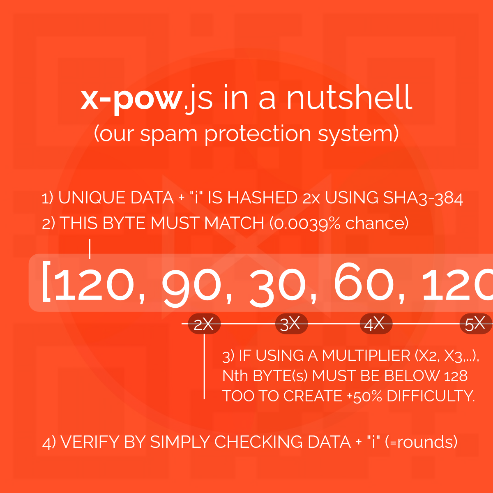

# x-pow.js: Simple Spam Protection with 48 Possible Difficulties
Simpe Proof of Work Function for Spam Protection using 2X SHA3-384. 

Made for https://x-currency.org, useable for other projects as well. 

### Install
```
git clone https://github.com/neil-yoga-crypto/x-pow.js
npm install @noble/hashes --save # install dependency for SHA3-384 hash function
## copy x-pow.js
```

### Usage
X-pow.js consists of 2 functions: createPow and verifyPow. You can verify the proof of work by letting verifyPow generate the hash using the rounds and your multiplier as input.  
```
import { createPow, verifyPow } from './x-pow.js';

// Default Usage
let powInput = '2,1::384981231'; // example data
let result = createPow(powInput);
console.log("expect true",verifyPow(result.rounds, powInput,result.multiplier));

// Custom PoW (Recommended)
let customMultiplier = 3; // relatively easy
let customFirstByte = 99;
let result2 = createPow(powInput,customMultiplier,customFirstByte);
console.log("customPow", verifyPow(result2.rounds, powInput,result2.multiplier,customFirstByte));

```

### How it works?


Here's how it works in code:
```
// 1. Multipliers can increase difficulty by +/- 50%, just by checking if additional n bytes are below 128, since there is a 100% certainty that a byte's value is between 0 and 255 and a +/- %50 certainty that a byte's valye is between 0 and 128.
        let validateMultiplier = true;
        if(multiplier > 1) {
            for(let i=1;i<multiplier;i++) {
                if(hash[i] > 128) validateMultiplier = false;
            }
        }
        
       // 2. Main algorithm simply check if the first bytes of the produced hash match expected firstByte (0.0039% chance for exact match, since one byte holds 256 possibilities: (1/256) )
       let valid = hash[0] === firstByte && validateMultiplier;
       return { valid:valid,hash:hash,rounds:rounds,multiplier:multiplier};
```

